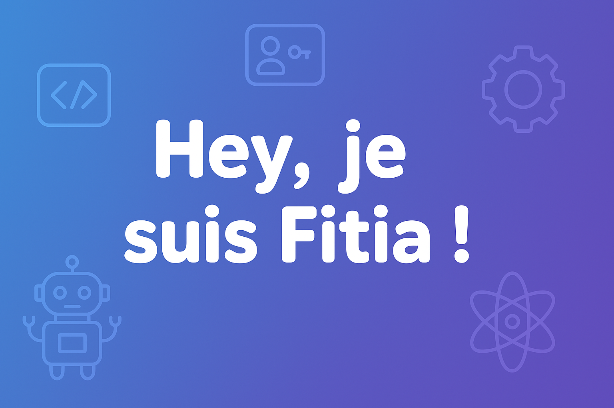

 

Je suis passionné par les nouvelles technologies, le développement web et j’aime créer des projets utiles et funs. 🚀  
J’adore apprendre en construisant, contribuer à des projets open-source, et partager ce que je découvre.

### 🚀 Ce que je fais actuellement :
- 🧑‍💻 Je travaille sur des projets fullstack (Node.js, React, MySQL).
- 🌱 J’apprends l’IA, le DevOps et la cybersécurité pour enrichir mes compétences.
- 🛠 Je développe des applications avec Docker, Prisma, et des API REST bien structurées.
- 📚 Je suis également en Bachelor 3 en développement web.

### ✨ En dehors du code :
- 🎮 Je m'intéresse aux jeux vidéo et à la robotique.
- 🏋️ Je m’entraîne régulièrement et je m’intéresse à la nutrition.
- 🧠 Toujours prêt(e) à relever de nouveaux défis et à apprendre davantage.

  
📌 Fun facts à propos de moi

   
  - J’aime les hackathons !  
  - J’ai une allergie aux fruits de mer 🍤❌  
  - Je rêve de créer un jour mon propre framework ou outil dev 😄

